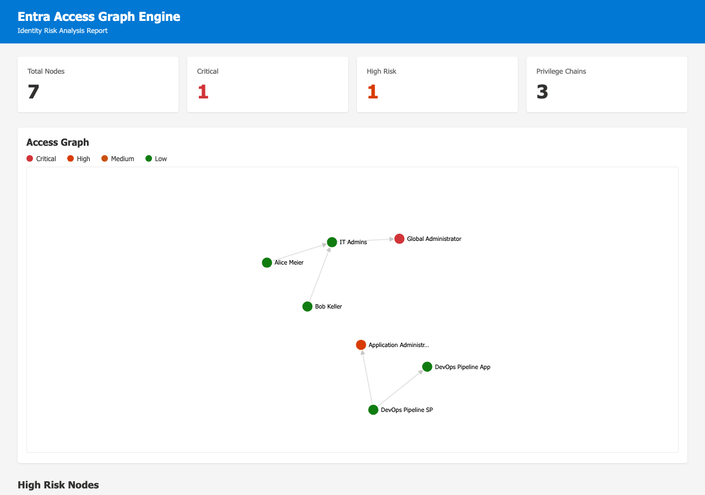

<div align="center">
  

  <h1>entra-access-graph-engine</h1>
</div>

[🇩🇪 Deutsche Version](README.de.md)

**Map every Entra ID object to a privilege graph. Detect escalation paths, hidden admin chains, and risk scores. Rust, offline-first, OTLP-ready.**

Fetches Users, Groups, Roles, Applications, Service Principals, AppRoleAssignments, and DirectoryRoles from the Microsoft Graph API and builds a directed access graph. The graph engine detects privilege escalation paths, hidden admin chains (App → SP → Group → GlobalAdmin), and classifies each node and path by risk level (Low / Medium / High / Critical). Exports as JSON, GraphML, or a self-contained HTML report with an interactive D3.js force graph.

[](https://github.com/9t29zhmwdh-coder/entra-access-graph-engine/actions)     

> **How it runs:** This is a command-line tool, not a desktop app and not a server. `eagraph scan` runs once and writes a report (JSON/GraphML/HTML); there is no installer and no background process.



---

> 🌱 New here? → [Step-by-step guide for beginners](GETTING_STARTED.md)

---

**In practice:** you get an HTML report with an interactive graph showing which accounts can reach admin rights through which chains, fully testable without Azure credentials via `--dry-run`.

## Features

| Feature | Description |
|---|---|
| Full Entra ID coverage | Users, Groups, DirectoryRoles, Applications, ServicePrincipals, AppRoleAssignments, OAuthPermissionGrants |
| Privilege chain detection | BFS up to depth 6 from every high-risk node, finds all escalation paths |
| Risk scoring | Well-known role template IDs and Graph API permission names mapped to Critical / High / Medium / Low |
| Three export formats | JSON (machine-readable), GraphML (Gephi / yEd), HTML with interactive D3.js force graph |
| Weekly scan action | GitHub Actions workflow for scheduled risk reports, uploaded as artifacts |
| Dry-run mode | `--dry-run` uses built-in mock graph for CI and demos without Azure credentials |
| Workspace crate layout | `eagraph-core` (library) + `eagraph-cli` (binary) |

---

## Risk Levels

| Level | Examples |
|---|---|
| Critical | Global Administrator, Privileged Role Administrator, apps with `RoleManagement.ReadWrite.Directory` |
| High | Application Administrator, User Administrator, Exchange Administrator, apps with `User.ReadWrite.All` |
| Medium | All other directory roles |
| Low | Users, Groups, apps without known high-risk permissions |

---

## Requirements

- Rust 1.78+
- Azure App Registration with **Application** (not delegated) permissions: `Directory.Read.All`, `RoleManagement.Read.Directory`, `Application.Read.All`

---

## Quick Start

```bash
git clone https://github.com/9t29zhmwdh-coder/entra-access-graph-engine.git
cd entra-access-graph-engine
cargo build --release

# Test without Azure credentials
./target/release/eagraph scan --dry-run --format html --output report

# Live scan
export AZURE_TENANT_ID=your-tenant-id
export AZURE_CLIENT_ID=your-client-id
export AZURE_CLIENT_SECRET=your-client-secret
./target/release/eagraph scan --format html --output report --min-risk high
```

---

## Uninstall / Cleanup

Delete the `target/` build directory and any generated report files (`report.html`, `.json`, `.graphml`). No credentials or intermediate data are stored outside these files.

---

## Output Examples

See [`examples/sample_graph.json`](examples/sample_graph.json) and [`examples/sample_risk_report.json`](examples/sample_risk_report.json).

---

## Project Structure

```
crates/
  eagraph-core/src/
    graph_client.rs      Microsoft Graph API client (OAuth2, pagination)
    node_builder.rs      API response to Node/Edge model + mock graph
    edge_analyzer.rs     petgraph DiGraph wrapper (EntraGraph)
    chain_detector.rs    BFS privilege chain finder (max depth 6)
    risk_scorer.rs       Role template ID and permission-based risk scoring
    exporter.rs          JSON, GraphML, HTML + D3.js export
    model.rs             Node, Edge, AccessGraph, PrivilegeChain, RiskReport
  eagraph-cli/src/
    main.rs              CLI entry point (clap)
.github/workflows/
  ci.yml                 Ubuntu + Windows CI (check, clippy, test)
  weekly-scan.yml        Scheduled Monday 06:00 UTC scan with artifact upload
examples/
  sample_graph.json      Sample AccessGraph
  sample_risk_report.json Sample RiskReport
```

---

## Azure Integration

See [`docs/azure_integration.md`](docs/azure_integration.md) for:
- App Registration setup and required permissions
- Weekly scan GitHub Actions secrets configuration
- KQL queries for Application Insights

---

## Roadmap

See [ROADMAP.md](ROADMAP.md).

---

**Author:** [Rafael Yilmaz](https://github.com/9t29zhmwdh-coder) · **Status:** Active ·  · **License:** MIT
